# 2024_IA651_RSDJ_final_project
Repository for final project from Rakshith and Dhanumjay 

<H1> TITLE : LOAN DEFAULT PREDICTION  </H1>
<H2> FINAL PROJECT IA651</H2>
<H4> RAKSHITH AND DHANUMJAY </H4>

<h4>ABSTRACT</h4>
        
In today's fast-paced world, accurate risk assessment is crucial for financial institutions to mitigate potential losses and ensure sustainable growth. This project focuses on developing a robust machine learning model to predict the risk associated with individuals based on various socio-economic and demographic factors. The dataset used comprises detailed information on individuals' income, age, experience, marital status, house and car ownership, profession, city, state, current job years, and current house years.

        
The training dataset includes a 'Risk_Flag' which indicates whether an individual is considered a risk or not. By analyzing this dataset, we aim to uncover patterns and relationships between the input features and the risk flag. The test dataset, devoid of the risk flag, is utilized to validate the model's predictive power.

        
In this study, we employ a range of machine learning algorithms to identify the most effective model for risk prediction. The results of this project are expected to provide valuable insights for financial institutions, helping them to better assess and manage potential risks associated with their clients.

<h4>OBJECTIVES</h4>
    <ul>
        <li><strong>Data Analysis and Preprocessing</strong>
            <ul>
                <li>Conduct a thorough exploratory data analysis (EDA) to understand the distribution, patterns, and relationships within the data.</li>
                <li>Identify and handle missing values by removing or imputing them to ensure data integrity.</li>
                <li>Handle outliers and perform necessary data cleaning to ensure data quality.</li>
                <li>Encode categorical variables and normalize numerical features to prepare the data for modeling.</li>
            </ul>
        </li>
        <li><strong>Feature Selection and Engineering</strong>
            <ul>
                <li>Identify the most relevant features that contribute to predicting the risk flag.</li>
                <li>Create new features or transform existing ones to enhance the model's predictive power.</li>
            </ul>
        </li>
        <li><strong>Model Development and Evaluation</strong>
            <ul>
                <li>Develop multiple machine learning models including logistic regression, decision trees, random forests, and gradient boosting to predict the risk flag.</li>
                <li>Train and validate these models using appropriate metrics such as accuracy, precision, recall, and F1-score.</li>
                <li>Perform hyperparameter tuning to optimize the performance of the selected models.</li>
            </ul>
        </li>
        <li><strong>Model Comparison and Selection</strong>
            <ul>
                <li>Compare the performance of different models and select the one with the best predictive accuracy and generalizability.</li>
                <li>Analyze the feature importance to understand the key factors influencing risk prediction.</li>
            </ul>
        </li>
        <li><strong>Deployment and Interpretation</strong>
            <ul>
                <li>Develop a user-friendly interface or application to deploy the final model for practical use by financial institutions.</li>
                <li>Provide clear and actionable insights derived from the model to assist in decision-making processes.</li>
            </ul>
        </li>
        <li><strong>Documentation and Reporting</strong>
            <ul>
                <li>Document the entire process including data preprocessing steps, model development, evaluation results, and final conclusions.</li>
                <li>Prepare a comprehensive report summarizing the findings and recommendations for stakeholders.</li>
            </ul>
        </li>
    </ul> 
<h4>Introduction</h4>
    
In the financial sector, accurate risk assessment is essential for mitigating potential losses and ensuring sustainable growth. With the increasing availability of diverse data sources, machine learning has become a powerful tool for predicting risk and making informed decisions. This project aims to develop a robust machine learning model to predict the risk associated with individuals based on a variety of socio-economic and demographic factors.

    
The dataset utilized in this project includes detailed information on individuals' income, age, experience, marital status, house and car ownership, profession, city, state, current job years, and current house years. By analyzing these features, the goal is to uncover patterns and relationships that can effectively predict whether an individual poses a risk.

    
Through data preprocessing, feature engineering, and the development of various machine learning models, this project seeks to identify the most accurate and generalizable model. The findings and insights derived from this model will provide valuable tools for financial institutions to better assess and manage potential risks associated with their clients.

<h4>DATA COLLECTION</h4>
    
The datasets employed in this project were found after a rigorous search for the best datasets on various platforms. These datasets were finally sourced from Kaggle and are frequently utilized for machine learning and data analysis endeavors, providing a solid foundation for developing predictive models.

    <h4>Datasets</h4>
    <ul>
        <li><strong>Training Data</strong>
            <ul>
                <li><strong>Source</strong>: Kaggle</li>
                <li><strong>Description</strong>: This dataset comprises detailed information on individuals, encompassing a wide range of socio-economic and demographic attributes. Key features include income, age, professional experience, marital status, house ownership, car ownership, profession, city, state, current job duration, and current house duration. The target variable 'Risk_Flag' indicates whether an individual is considered a risk (1) or not (0).</li>
                <li><strong>Purpose</strong>: The training data is used to develop and train machine learning models aimed at predicting the risk flag based on the provided features.</li>
            </ul>
        </li>
    <h4>DATA FEATURES</h4>
    <ul>
        <li><strong>Income</strong>: Annual income of the individual.</li>
        <li><strong>Age</strong>: Age of the individual.</li>
        <li><strong>Experience</strong>: Number of years of professional experience.</li>
        <li><strong>Married/Single</strong>: Marital status of the individual.</li>
        <li><strong>House_Ownership</strong>: Status of house ownership (owned or rented).</li>
        <li><strong>Car_Ownership</strong>: Status of car ownership.</li>
        <li><strong>Profession</strong>: Professional occupation of the individual.</li>
        <li><strong>CITY</strong>: City of residence.</li>
        <li><strong>STATE</strong>: State of residence.</li>
        <li><strong>CURRENT_JOB_YRS</strong>: Number of years spent in the current job.</li>
        <li><strong>CURRENT_HOUSE_YRS</strong>: Number of years spent in the current house.</li>
        <li><strong>Risk_Flag</strong> (Training Data Only): Indicator of risk (1 for risk, 0 for no risk).</li>
    </ul>
    <h4>DATA PREPROCESSING</h4>
    
Prior to model training and validation, several essential preprocessing steps were carried out to ensure data quality and integrity:

    <ul>
        <li><strong>Handling Missing Values</strong>: Any missing values within the datasets were identified and addressed through removal or imputation techniques to maintain dataset completeness.</li>
        <li><strong>Data Cleaning</strong>: Outliers and anomalies were managed, and necessary cleaning operations were performed to enhance data consistency and reliability.</li>
        <li><strong>Feature Encoding</strong>: Categorical variables were encoded using appropriate methods, and numerical features were normalized to facilitate effective machine learning model training.</li>
    </ul>
    
By sourcing and preprocessing the datasets from Kaggle, this project leverages a diverse and comprehensive dataset, thereby enabling the development of robust and accurate machine learning models for risk prediction.

<h4>Distributions</h4>
            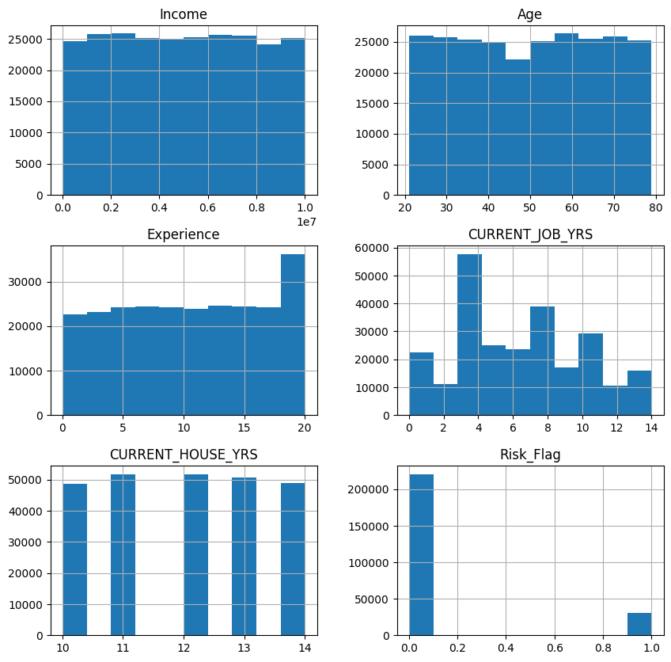
<h4>Analysis of Income Distribution</h4>

The bar plot shows the income distribution among individuals:

<ul>
    <li><strong>Uniform Distribution:</strong> 
        The bars have similar heights, indicating that income levels are evenly distributed among individuals.
    </li>
    <li><strong>Income Range:</strong> 
        Income ranges from 0 to about 10 million, covering a wide spectrum.
    </li>
    <li><strong>Even Distribution:</strong> 
        Each bin has around 25,000 individuals, showing no significant skewness.
    </li>
</ul>

<h5>Key Observations</h5>
<ul>
    <li>The dataset is evenly distributed across income levels, with no significant skew.</li>
    <li>Income alone may not be a distinguishing factor without considering other variables.</li>
</ul>

<h4>Age Distribution</h4>
        
The histogram shows the distribution of ages in the dataset, ranging from 20 to 80 years. The age groups are relatively evenly distributed, with each bin containing around 20,000 to 25,000 individuals. There's a slight dip in the 40s and 50s age bins, while the 60s have the highest count, exceeding 25,000 individuals. This balanced distribution suggests a well-represented dataset across different age groups, though the dip in the 40s and 50s may warrant further investigation.

 <h4>Experience Distribution</h4>
        
The histogram shows the distribution of the experience variable, ranging from 0 to 20 years. Most bins (0 to 17.5 years) have a relatively uniform count of 20,000 to 25,000 individuals. However, there's a significant spike at 20 years, with over 35,000 individuals. This suggests a large number of individuals have exactly 20 years of experience, which may warrant further investigation to ensure data accuracy and assess its impact on the risk prediction model.

 <h4>Current Job Years Distribution</h4>
        
The histogram shows the distribution of current_job_yrs:

        <ul>
            <li>Range: 0 to 14 years.</li>
            <li>Key Observations:
                <ul>
                    <li>Peak at 4 years (~60,000 individuals).</li>
                    <li>Notable peaks at 8 and 10 years (~35,000-40,000 individuals).</li>
                    <li>Lower counts at 2, 6, 12, and 14 years (~10,000-20,000 individuals).</li>
                </ul>
            </li>
            <li>Implications: The peak at 4 years suggests many individuals have this job duration, which may impact risk assessment.</li>
            <li>Next Steps: Investigate the concentration at 4 years and its effect on the model.</li>
        </ul> 
  <h4>Current House Years Distribution</h4>
        
The histogram shows the distribution of current_house_yrs:

        <ul>
            <li>Range: 10 to 14 years.</li>
            <li>Peaks at 11 and 12 years (~50,000 individuals).</li>
            <li>Lower counts at 10, 13, and 14 years (~45,000-50,000 individuals).</li>
        </ul>
        
This indicates stable representation of house years with no significant outliers.

  <h4>Risk Flag Distribution</h4>
        
The histogram shows the distribution of risk_flag:

        <ul>
            <li>Range: 0 (not a risk) and 1 (risk).</li>
            <li>Majority (over 200,000) have a risk flag of 0.</li>
            <li>Minority (under 50,000) have a risk flag of 1.</li>
        </ul>
        
This indicates class imbalance, with far more non-risk individuals than risk individuals.

<h4>Income vs Risk Flag Analysis</h4>
            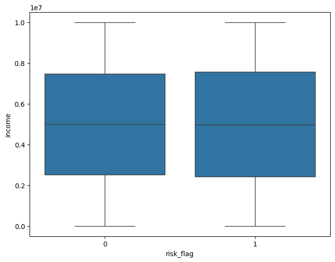
        
The box plot shows the distribution of income for each risk_flag category:

        <ul>
            <li>Median income is similar for both risk (1) and non-risk (0) groups.</li>
            <li>Both groups have a similar interquartile range and overall distribution.</li>
            <li>No significant outliers or differences between the two groups.</li>
        </ul>
        <h4>Age vs Risk Flag Analysis</h4>
            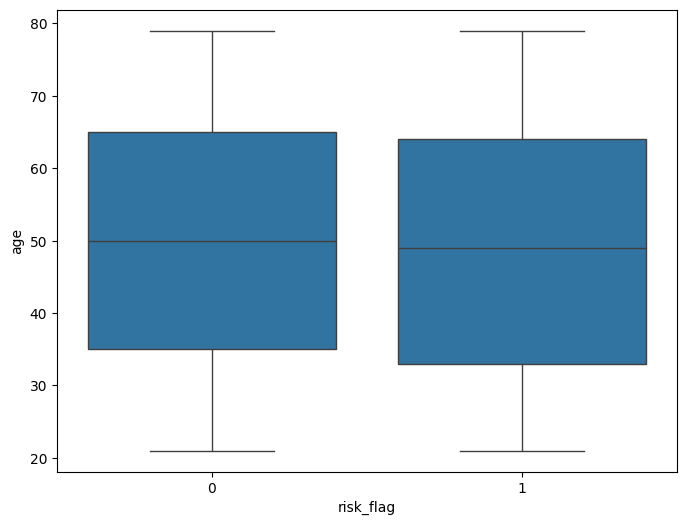
        
The box plot shows the distribution of age for each risk_flag category:

        <ul>
            <li>Median age is similar for both risk (1) and non-risk (0) groups.</li>
            <li>Both groups have a similar interquartile range and overall distribution.</li>
            <li>No significant outliers or differences between the two groups.</li>
        </ul>
        <h4>Experience vs Risk Flag Analysis</h4>
            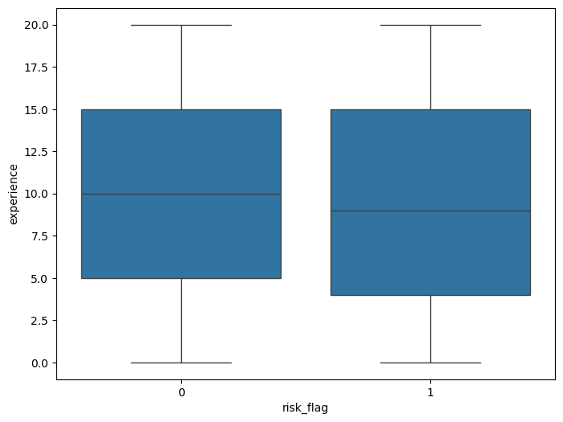
        
The box plot shows the distribution of experience for each risk_flag category:

        <ul>
            <li>Median experience is similar for both risk (1) and non-risk (0) groups.</li>
            <li>Both groups have a similar interquartile range and overall distribution.</li>
            <li>No significant outliers or differences between the two groups.</li>
        </ul>
            <h4>Current Job Years Distribution</h4>
            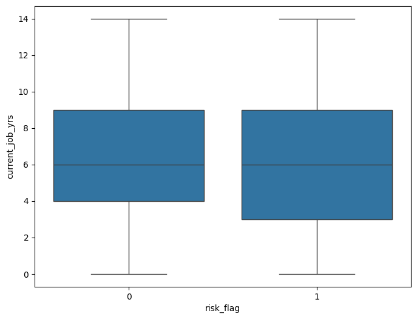
        
The histogram shows the distribution of current_job_yrs:

        <ul>
            <li>Range: 0 to 14 years.</li>
            <li>Key Observations:
                <ul>
                    <li>Peak at 4 years (~60,000 individuals).</li>
                    <li>Notable peaks at 8 and 10 years (~35,000-40,000 individuals).</li>
                    <li>Lower counts at 2, 6, 12, and 14 years (~10,000-20,000 individuals).</li>
                </ul>
            </li>
            <li>Implications: The peak at 4 years suggests many individuals have this job duration, which may impact risk assessment.</li>
            <li>Next Steps: Investigate the concentration at 4 years and its effect on the model.</li>
        </ul> 
        <h4>Current House Years vs Risk Flag Analysis</h4>
            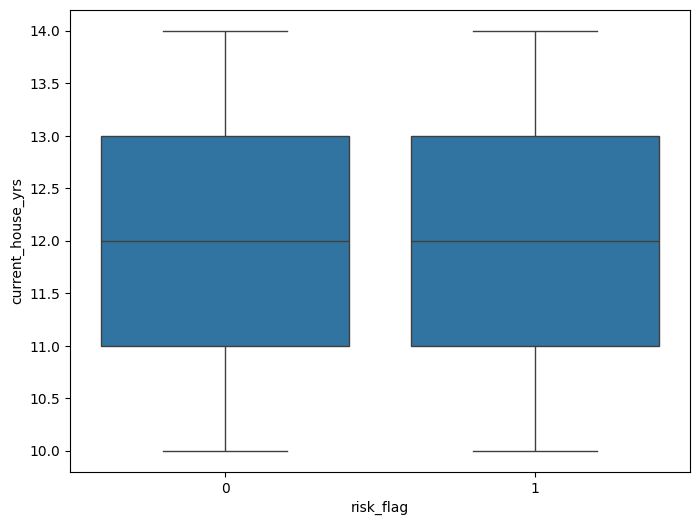
        
The box plot shows the distribution of current_house_yrs for each risk_flag category:

        <ul>
            <li>Median house years are similar for both risk (1) and non-risk (0) groups.</li>
            <li>Both groups have a similar interquartile range and overall distribution.</li>
            <li>No significant outliers or differences between the two groups.</li>
        </ul>
        <h4>Feature Comparison vs Risk Flag Analysis</h4>
        
The subplots compare various features against the risk_flag:

        <ul>
            <li>Income: Slightly higher for non-risk individuals across all categories.</li>
            <li>Age, Experience, Current Job Years, Current House Years: Similar distributions for both risk and non-risk individuals across all categories.</li>
            <li>Marital Status, House Ownership, Car Ownership: No significant difference in risk distribution.</li>
        </ul>
        <h4>Variation in Scales Across Socio-Economic Factors and Risk Categories</h4>
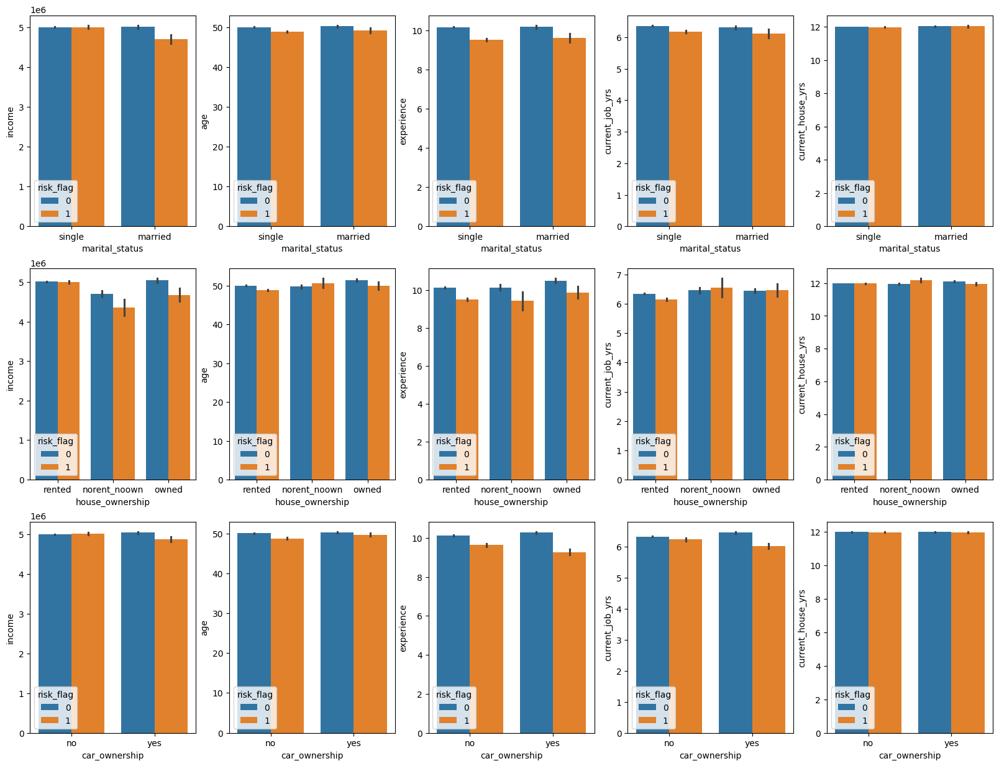

The subplots demonstrate that the scales of the various socio-economic factors are distinct across different risk categories. Here are the observations for each factor:

<ul>
    <li>Income:
        <ul>
            <li>The scale for income ranges from 0 to approximately 5 million, indicating a broad range of income levels. This wide range is consistent across marital status, house ownership, and car ownership categories.</li>
        </ul>
    </li>
    <li>Age:
        <ul>
            <li>The age scale ranges from 0 to around 60 years. This narrower scale compared to income reflects the natural limits of the age variable.</li>
        </ul>
    </li>
    <li>Experience:
        <ul>
            <li>The scale for experience ranges from 0 to around 10 years. This indicates a limited range for the number of years of professional experience, consistent across all categories.</li>
        </ul>
    </li>
    <li>Current Job Years:
        <ul>
            <li>The current job years scale ranges from 0 to about 7 years, showing that the tenure in the current job is relatively short across the dataset.</li>
        </ul>
    </li>
    <li>Current House Years:
        <ul>
            <li>The scale for current house years ranges from 0 to about 12 years. This factor shows a relatively broader range compared to experience and current job years but still remains much smaller than the scale for income.</li>
        </ul>
    </li>
</ul>

These observations confirm that the scales are indeed different across the socio-economic factors. Income has the broadest range, reflecting potentially high variability in financial data, while other variables like age, experience, current job years, and current house years have narrower and more naturally limited ranges. This difference in scales suggests that each feature captures a unique aspect of the socio-economic status and cannot be directly compared without appropriate scaling or normalization.

<h4>Analysis of House Ownership vs. Risk Flag</h4>
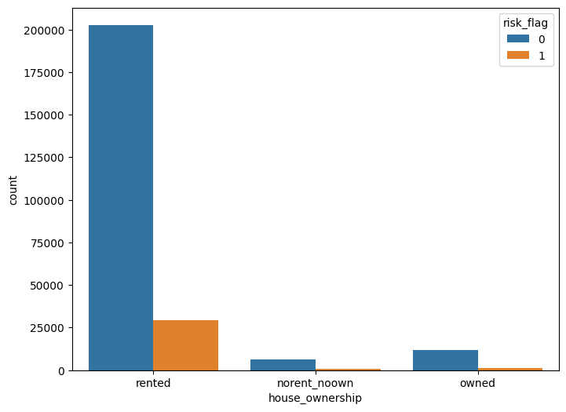
<ul>
    <li><strong>Rented Housing:</strong>
        <ul>
            <li>The majority of individuals rent their homes.</li>
            <li>Most renters are non-risk (risk flag 0), with a smaller number identified as risk (risk flag 1).</li>
        </ul>
    </li>
    <li><strong>No Rent, No Own (norent_noown):</strong>
        <ul>
            <li>This category has very few individuals.</li>
            <li>Slightly more individuals are non-risk compared to those identified as risk.</li>
        </ul>
    </li>
    <li><strong>Owned Housing:</strong>
        <ul>
            <li>A smaller group owns their homes, with non-risk individuals again being more prevalent than risk individuals.</li>
        </ul>
    </li>
</ul>

<h5>Key Observations</h5>
<ul>
    <li>Renting is the most common housing status.</li>
    <li>Non-risk individuals outnumber risk individuals across all house ownership categories.</li>
    <li>The dataset shows a strong imbalance, with the majority being renters.</li>
</ul>

<h4>Analysis of Car Ownership vs. Risk Flag</h4>
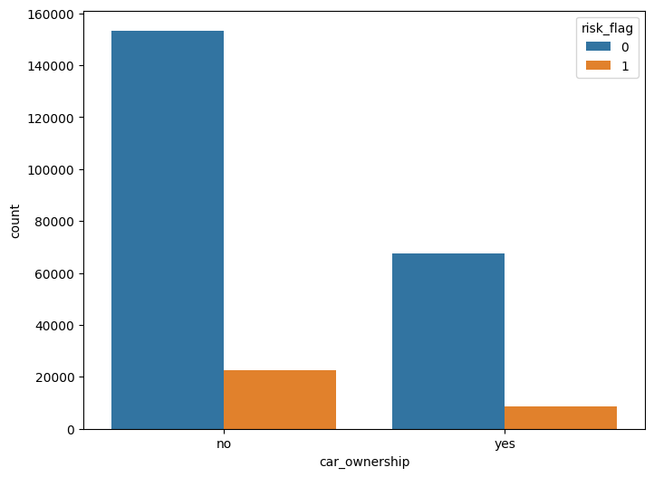<ul>
    <li><strong>No Car Ownership:</strong>
        <ul>
            <li>Most individuals do not own a car.</li>
            <li>Non-risk individuals (risk flag 0) greatly outnumber risk individuals (risk flag 1).</li>
        </ul>
    </li>
    <li><strong>Car Ownership:</strong>
        <ul>
            <li>Fewer individuals own cars.</li>
            <li>Non-risk individuals still outnumber risk individuals, though the counts are lower compared to the non-car owners.</li>
        </ul>
    </li>
</ul>

<h5>Key Observations</h5>
<ul>
    <li>The majority of individuals are non-car owners.</li>
    <li>In both categories, non-risk individuals are more prevalent than risk individuals.</li>
    <li>There is a clear imbalance, with a larger group of non-car owners compared to car owners.</li>
</ul>
<h4>Analysis of Marital Status vs. Risk Flag</h4>
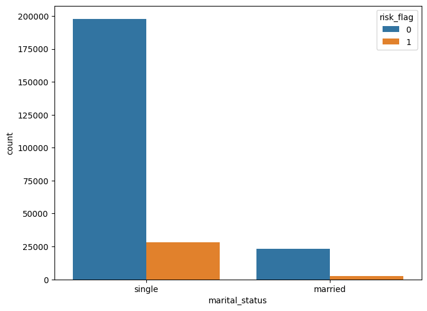<ul>
<ul>
    <li><strong>Single Individuals:</strong>
        <ul>
            <li>Predominantly non-risk (risk flag 0) compared to risk (risk flag 1).</li>
            <li>Larger count compared to married individuals.</li>
        </ul>
    </li>
    <li><strong>Married Individuals:</strong>
        <ul>
            <li>Fewer in number than single individuals.</li>
            <li>More non-risk individuals than risk individuals.</li>
        </ul>
    </li>
</ul>

<h5>Key Observations</h5>
<ul>
    <li>Majority are single, with non-risk individuals prevailing in both categories.</li>
    <li>Significant imbalance favoring single individuals over married ones.</li>
</ul>
<h4>Top 10 Cities with the Highest Number of Defaulters</h4>

The project identified the cities with the most defaulters by:

<ol>
    <li><strong>Filtering:</strong> Selecting only individuals marked as defaulters (<code>risk_flag</code> = 1).</li>
    <li><strong>Grouping:</strong> Grouping these individuals by city.</li>
    <li><strong>Counting and Sorting:</strong> Counting the number of defaulters per city and listing the top 10 cities with the highest counts.</li>
</ol>

This analysis highlights areas with higher financial risk due to a greater number of defaulters, aiding in targeted risk management.

<h4>Top 10 Cities with the Highest Number of Non-Defaulters</h4>

Following the analysis of defaulters, a similar approach was taken to identify the cities with the highest number of non-defaulters:

<ol>
    <li><strong>Filtering:</strong> The dataset was filtered to include only individuals marked as non-defaulters (<code>risk_flag</code> = 0).</li>
    <li><strong>Grouping:</strong> These individuals were grouped by city.</li>
    <li><strong>Counting and Sorting:</strong> The number of non-defaulters per city was counted and sorted in descending order to find the top 10 cities.</li>
</ol>

This analysis highlights areas with a strong presence of financially stable individuals, useful for understanding market segments and planning business strategies.

<h4>Counting Unique Categories in Categorical Columns</h4>

The process involved:

<ol>
    <li><strong>Looping Through Columns:</strong> Each categorical column was analyzed.</li>
    <li><strong>Counting Unique Values:</strong> The number of unique categories in each column was counted.</li>
    <li><strong>Output:</strong> The column names and their respective unique category counts were printed.</li>
</ol>

TFor the variables 'martial_status' and 'car_ownership' can be binary encoded,
while 'house_ownership' can be one hot encoded and other variables will be target encoded 

<h4>Correlation Analysis of Numerical Columns</h4>
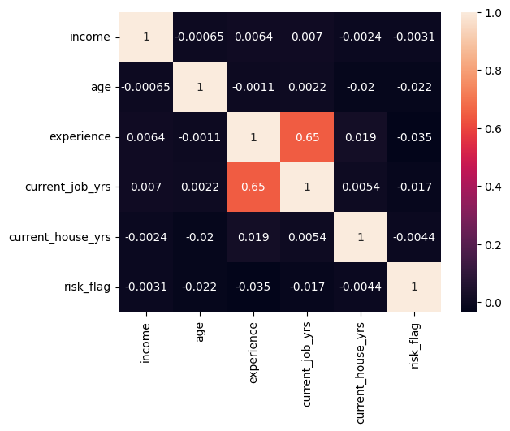<ul>

The analysis involved:

<ol>
    <li><strong>Numerical Columns Selected:</strong> Included <code>income</code>, <code>age</code>, <code>experience</code>, <code>current_job_yrs</code>, <code>current_house_yrs</code>, and <code>risk_flag</code>.</li>
    <li><strong>Heatmap Creation:</strong> A heatmap was generated to visualize the correlation matrix, with correlation coefficients displayed.</li>
    <li><strong>Visualization:</strong> The heatmap provided a visual representation of the relationships between the numerical variables.</li>
</ol>

This analysis highlighted significant correlations among the variables.

<h4>Splitting the Dataset into Training and Testing Sets</h4>

The dataset was split into features (X) and the target variable (y) by separating the <code>risk_flag</code> column. The data was then divided into training (80%) and testing (20%) sets for model evaluation, ensuring reproducibility with a specified <code>random_state</code>.

<h4>Mapping Categorical Values to Numerical Values</h4>

Categorical values in the <code>marital_status</code> and <code>car_ownership</code> columns were mapped to numerical values, with 'married' as 1 and 'single' as 0 for marital status, and 'yes' as 1 and 'no' as 0 for car ownership. This transformation was applied to both the training and testing datasets.

<h4>Target Encoding of Categorical Features</h4>

Target encoding was applied to the <code>profession</code>, <code>city</code>, and <code>state</code> columns using the <code>TargetEncoder</code> from the <code>category_encoders</code> library. The encoder was fitted on the training data and subsequently used to transform both the training and test datasets based on the target variable.

<h4>One-Hot Encoding of House Ownership</h4>

The <code>house_ownership</code> column was one-hot encoded using the <code>OneHotEncoder</code> from scikit-learn. This process involved fitting the encoder on the training data, transforming both the training and test sets, and replacing the original column with the encoded features.

<h4>Evaluation Metrics for Model Performance</h4>

A function was defined to print key evaluation metrics, including the classification report and confusion matrix. These metrics provide insights into the model's precision, recall, F1-score, and the distribution of true vs. predicted classifications.

<h4>Logistic Regression Model Training and Evaluation</h4>

A Logistic Regression model was trained using the training data with a maximum of 500,000 iterations for convergence. The model's accuracy on the test set was calculated and expressed as a percentage, indicating the proportion of correctly classified instances.

<h4>Scaling Numerical Features</h4>

The numerical columns <code>income</code>, <code>age</code>, <code>experience</code>, <code>current_job_yrs</code>, and <code>current_house_yrs</code> were scaled using <code>StandardScaler</code>. This process standardizes the features to have a mean of 0 and a standard deviation of 1, ensuring consistency between the training and test datasets.

<h4>Training and Evaluation of Logistic Regression on Scaled Data</h4>

A Logistic Regression model was trained using the scaled training data. The model's performance was evaluated on the scaled test set, with accuracy reported as a percentage and a classification report detailing precision, recall, and F1-score for each class.

<h4>Analysis of Risk Flag Distribution</h4>
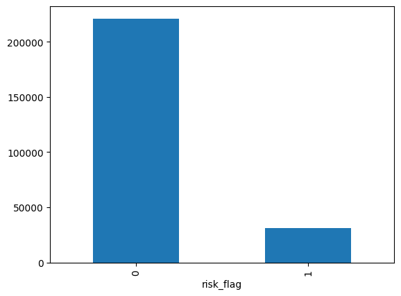

The bar chart shows a significant imbalance between the two classes:

<ul>
    <li><strong>Non-Risk (0):</strong> Most individuals are classified as non-risk.</li>
    <li><strong>Risk (1):</strong> A smaller number are classified as risk.</li>
</ul>

This indicates a predominance of non-risk individuals in the dataset.

<h4>Balancing Classes with SMOTE</h4>

SMOTE (Synthetic Minority Over-sampling Technique) was applied to the training and test data to generate synthetic samples for the minority class, balancing the class distribution. This process aimed to improve model performance by addressing the class imbalance in the dataset.

<h4>Logistic Regression on SMOTE-Balanced Data</h4>

A Logistic Regression model was trained on the SMOTE-balanced dataset, and its performance was evaluated using accuracy and a classification report. The model achieved balanced precision, recall, and F1-scores for both classes, indicating a more equitable performance across the classes.

<h4>K-Nearest Neighbors Classifier on SMOTE-Balanced Data</h4>

A K-Nearest Neighbors (KNN) classifier was trained on the SMOTE-balanced dataset. The model achieved an accuracy of 76.33%, with the classification report indicating strong precision and recall, particularly for the non-risk class.

<h4>Gradient Boosting Classifier on SMOTE-Balanced Data</h4>

A Gradient Boosting Classifier was trained on the SMOTE-balanced dataset, achieving an accuracy of 69.62%. The classification report shows balanced precision and recall, with a slight advantage in recall for the risk class.

<h4>Random Forest Classifier on Original Data</h4>

A Random Forest Classifier was trained on the original training dataset, achieving high precision and recall for the non-risk class. The classification report shows an overall accuracy of 90%, with a noticeable performance difference between the non-risk and risk classes.

<h4>Spearman Correlation Heatmap of Training Data</h4>

A heatmap was generated to visualize the Spearman correlation matrix of the training dataset. This visual representation includes correlation coefficients for each feature pair, helping to identify monotonic relationships between variables.

<h4>Feature Reduction and SMOTE Application</h4>

Columns deemed less relevant were dropped from the dataset, and the reduced data underwent SMOTE to balance the class distribution. This process was applied to both the training and test sets, generating synthetic samples to address class imbalance.

<h4>Random Forest Classifier on Reduced SMOTE-Balanced Data</h4>

A Random Forest Classifier was trained on the reduced, SMOTE-balanced dataset. The model achieved high precision, recall, and F1-scores for both classes, with an overall accuracy of 92%, as evidenced by the classification report and confusion matrix.

<h4>Feature Importance Analysis</h4>
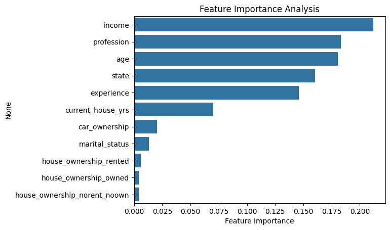

The bar chart displays the importance of each feature in the Random Forest model. Income and profession are identified as the most influential factors, while other features like marital status and house ownership type have a lesser impact on the model's predictions.

<h4>Further Feature Reduction and SMOTE Application</h4>

Additional columns considered less relevant or redundant were dropped from the dataset. SMOTE was applied to the reduced training and test sets to balance the class distribution, generating synthetic samples for the minority class.

<h4>Random Forest Classifier on Further Reduced SMOTE-Balanced Data</h4>

A Random Forest Classifier was trained on the further reduced, SMOTE-balanced dataset. The model achieved high accuracy with balanced precision, recall, and F1-scores for both classes, indicating effective classification performance with an overall accuracy of 92%.

<h4>Confusion Matrix for Random Forest Classifier</h4>
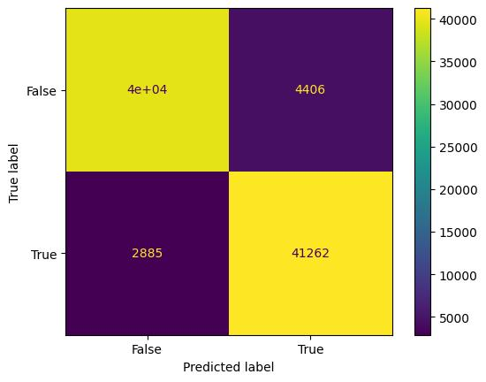

The confusion matrix shows that the Random Forest model correctly classified most instances, with a slight number of false positives and false negatives. The model demonstrates strong performance, with high counts in the true positive and true negative quadrants.

<h4>Random Forest Classifier on Scaled Data</h4>

A Random Forest Classifier was trained on the scaled dataset with specified parameters, including Gini impurity and a maximum depth of 10. The model achieved an overall accuracy of 88%, with high precision and recall for the non-risk class, but lower performance for the risk class as indicated by the classification report.

<h4>Hyperparameter Tuning with GridSearchCV</h4>

GridSearchCV was used to perform an exhaustive search over a defined parameter grid for the Random Forest Classifier. The best model achieved an accuracy of approximately 89.89% on the test set, with the optimal hyperparameters being a maximum depth of 20, using all features, and a minimum of 10 samples per split.

<h4>Evaluation of Random Forest Classifier on Scaled SMOTE-Balanced Data</h4>

A Random Forest Classifier was trained on the SMOTE-balanced, scaled dataset with specified parameters. The model's performance on the test set was evaluated, achieving an accuracy score of 89.89%. The classification report provided detailed metrics, including precision, recall, and F1-scores for each class.

<h4>Adding Predicted Risk Flag to Dataset</h4>

The predicted risk flags were added to the original dataset as a new column. The predictions, stored in <code>y_pred</code>, were converted into a pandas Series and combined with the existing data, creating a new DataFrame that includes both the original features and the predicted outcomes. This new dataset can be optionally saved to a CSV file for further analysis or reporting.

<h4>Saving and Loading the Model with Pickle</h4>

The trained Random Forest model was serialized and saved using the <code>pickle</code> library. The model can be reloaded for future predictions. An example prediction was made using specified input values for features such as income, age, experience, profession, city, state, current job years, and current house years.

<h4>Conclusion</h4>

The project successfully developed and evaluated several machine learning models for predicting the risk of loan defaults based on a variety of socio-economic and demographic factors. Through extensive data preprocessing, including handling missing values, encoding categorical variables, scaling numerical features, and applying SMOTE for class balancing, a robust dataset was prepared. Various models, such as Logistic Regression, K-Nearest Neighbors, Gradient Boosting, and Random Forest, were trained and evaluated.

The Random Forest Classifier emerged as one of the best-performing models, achieving a high accuracy and balanced precision-recall scores across both risk and non-risk classes. Hyperparameter tuning using GridSearchCV further optimized the model's performance, identifying the most effective parameter configurations.

This project not only demonstrated the importance of feature selection and engineering but also highlighted the need for careful consideration of class imbalances. The final model, equipped with the ability to accurately predict the risk flag, provides valuable insights for financial institutions, aiding them in making informed decisions and managing risk more effectively.

Future work could explore additional features, more sophisticated modeling techniques, and alternative strategies for handling class imbalance to further enhance predictive performance. Overall, this project sets a strong foundation for risk prediction in the financial domain.

